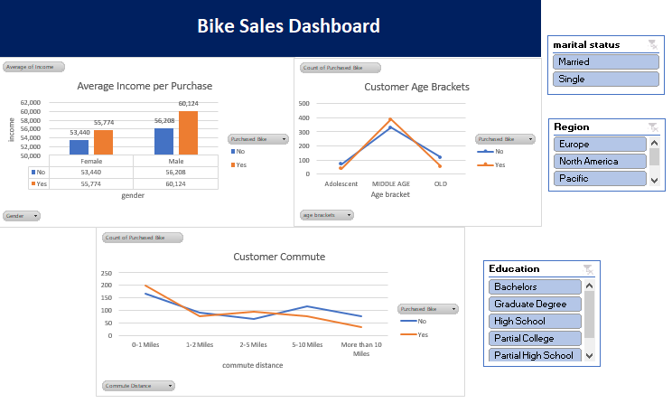

# 🚴‍♀️ **Bike Sales Dashboard** 🚴‍♂️  
**_Unlock Insights from Your Data!_**

---

## 📊 Project Overview

Welcome to the **Bike Sales Dashboard** project! This dashboard brings your bike sales data to life, helping you visualize key trends and customer behaviors in just a few clicks. Built with the power of **Excel**, this interactive dashboard is perfect for exploring how different factors like income, age, and commuting distance impact bike purchases. 🚀

---

## 🔍 What’s Inside?

Our dashboard offers a sleek, intuitive design with all the tools you need to dive deep into the data. Here’s what you can explore:

### **1. Average Income per Purchase 💵**
- See how **gender** and **purchase status** affect the average income of your customers.
- Visualize the spending habits of your buyers and non-buyers, broken down by gender.

### **2. Customer Age Brackets 🎂**
- Discover which **age group** (Adolescent, Middle Age, Old) is buying more bikes.
- Compare purchase behavior across age categories in just a glance.

### **3. Customer Commute 🚶‍♂️**
- Analyze the relationship between **commute distance** and bike purchases.
- Understand how far your customers travel and whether they are likely to buy based on distance.

### **4. Interactive Filters 🎛️**
- **Marital Status**: Married vs. Single
- **Region**: Europe, North America, Pacific
- **Education Level**: Bachelors, Graduate Degree, High School, and more!

With just a few clicks, adjust these filters to reveal insights that matter most to you!

---

## 🔨 How It Was Built

We followed a systematic approach to create this dashboard:

1. **Data Cleaning**: Tidied up raw data to remove inconsistencies, handle missing values, and ensure everything is accurate.
2. **Pivot Table Magic** ✨: Created powerful pivot tables to summarize bike sales data based on various metrics like gender, income, and commute distance.
3. **Dashboard Design**: Linked pivot tables to sleek, interactive visualizations with slicers for easy filtering. Everything is optimized for simplicity and clarity.

---

## 🌟 Key Insights You Can Unlock:

- **Middle-aged** customers are the most frequent bike buyers. 🧑‍🦳
- **Higher-income males** are more likely to make a purchase. 💼
- Customers who commute **short distances (0-1 miles)** are most likely to buy, while non-buyers often travel farther.

---

## 💻 How to Use the Dashboard

It’s simple! Follow these steps to get started:
1. **Download the Excel file** containing the data and dashboard.
2. Open it up in **Microsoft Excel**.
3. Explore the data by adjusting the slicers (Marital Status, Region, Education) to see dynamic changes in the visuals.

---

## 🔧 Tailor it to Your Needs!

This dashboard isn’t just limited to what’s already built. It’s **flexible** and ready for more! 🛠️ You can:
- Add more **data** to analyze specific regions, customer groups, or time periods.
- **Customize** the filters for deeper insights into your customers.
- **Adapt the visuals** to highlight key trends that matter most to your business.

With this dashboard, you have the power to dig as deep as you need! 🌍📈

---

## ⚙️ Tools & Tech

- **Microsoft Excel**: Our go-to tool for data cleaning, analysis, and creating dynamic, visual insights.
  
---

## 🚀 Ready to Explore?

Unlock the hidden patterns in your bike sales data with the **Bike Sales Dashboard**. Start exploring today and transform your data into valuable insights!

